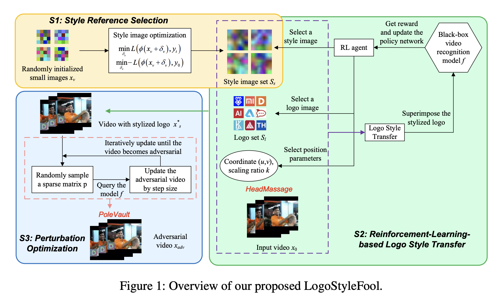

-- Disclaimer: This GitHub repository is under routine maintenance.
  
# LogoStyleFool

<div align="center">
  
</div>

This is the source code for the paper "LogoStyleFool: Vitiating Video Recognition Systems via Logo Style Transfer" (AAAI 2024).

## Requirements
+ python 3.6
+ pytorch 1.4.0
+ kornia 0.2.2
+ torchvision 0.11.3
+ easydict
+ opencv
+ scikit-learn
+ tqdm
+ scipy

## Dataset

* You need to download the action recognition dataset [UCF-101](http://crcv.ucf.edu/data/UCF101.php) and [HMDB51](https://serre-lab.clps.brown.edu/resource/hmdb-a-large-human-motion-database/#Downloads), then process and save them in 'data/'

## Pretrained model
We use the pre-trained models from [here]().

## Usage

### LogoStyleFool Attack

**Targeted attack**

Run `python main.py --model C3D --dataset UCF101 --video_npy_path .data/UCF-101_npy/BenchPress/v_BenchPress_g20_c06.npy --label 9 --target --target_class 55 --output_path result/`.

**Untargeted attack**

Run `python main.py --model C3D --dataset UCF101 --video_npy_path ./data/UCF-101_npy/FrontCrawl/v_FrontCrawl_g09_c03.npy --label 31 --output_path result/`.

**Basic arguments**:
* `--model`: The attacked model.
* `--dataset`: The dataset.
* `--gpu`: ID of the GPU to use.
* `--video_npy_path`: The video path in npy forms.
* `--label`: The label of the video.
* `--target`: Targeted attack or untargeted attack (default).
* `--target_class`: Targeted attack class.
* `--output_path`: The path to save output_adversarial_npy_path.
* `--rl_batch`: The batch size of RL.
* `--steps`: The steps of RL. 
* `--sigma`: The RL reward ratio to control area.
* `--tau`: The RL reward ratio to control distance.
* `--logo_num`: The num of logos.
* `--style_num`: The num of style imgs.
* `--max_iters`: The max iters of LogoS-DCT.
* `--epsilon`: The epsilon of LogoS-DCT.
* `--linf_bound`: The linf bound of perturbation.(0 ~ 1 for logostylefool-$l_2$ and 0 for logostylefool-$l_\infty$)
  

## Acknowledgement
* Part of our implementation is based on [LinearStyleTransfer](https://github.com/sunshineatnoon/LinearStyleTransfer), [PatchAttack](https://github.com/Chenglin-Yang/PatchAttack) and [simple-blackbox-attack](https://github.com/cg563/simple-blackbox-attack).

## Citation

If you use this code or its parts in your research, please cite the following paper:
```
@misc{cao2023logostylefool,
      title={LogoStyleFool: Vitiating Video Recognition Systems via Logo Style Transfer}, 
      author={Yuxin Cao and Ziyu Zhao and Xi Xiao and Derui Wang and Minhui Xue and Jin Lu},
      year={2023},
      eprint={2312.09935},
      archivePrefix={arXiv},
      primaryClass={cs.CV}
}
```
